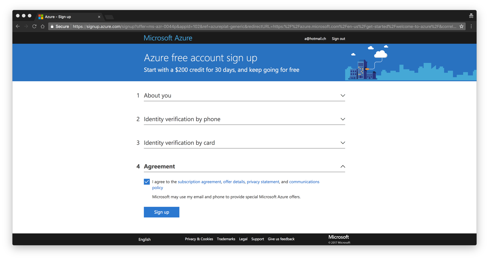
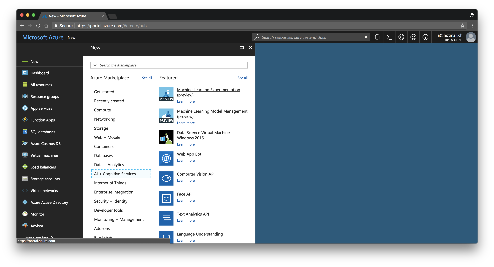

# Getting Started

## Requirements before installing 
Azure Machine Learning Services and Workbench relies on resources hosted in the Azure Cloud. To get started you will need:
1. [An Azure Subscription](https://azure.microsoft.com/en-us/free/) - $Free 
2. [An Experimentation Account](https://portal.azure.com) - $Free
3. [A Model Management Account](https://portal.azure.com) - $Free
4. Installing the Azure ML Workbench - $Free, require either Windows 10 or Mac OS High Sierra.
5. Installing an extension for your favorite IDE (VS Code or Visual Studio 2017). 

## Installation 

### Azure Subscription 
As mentioned in the requirements, you will need an [An Azure Subscription](https://azure.microsoft.com/en-us/free/) in order to use Azure Machine Learning. If you don't have one already, you will need both a mobile phone number and a credit card for authorization. The subscription comes with $200 credited. You won't have to use any of these for the basic functionalities of Azure Machine Learning. 

### Experimentation Account
Now that we have the subscription up and running, log-in to the [Azure Portal](https://portal.azure.com) and click on "+NEW", "AI + Cognitive Services", and "Machine Learning Experimentation (preview)".

This will open a page with a few options:
- **Experimentation account name** - the name you give to your experimentation account.
- **Subscription** - the subscription where to create the experimentation account.
- **Resource group** - a container holding all the required resources. 
- **Location** - The location where you want to host your resources (pick the one the closest to you geographically). 
- **Number of seats** - How many users will be using the experimentation account. 
- **Storage account** - Where the artifacts and history of your projects are stored.
- **Workspace** - Container for organizing your projects. 
- **Owner for the workspace** - Admin rights for the workspace. 
- **Create Model Management Account** - The resource to manage your model (deployment, versioning, ...).
- **Model Management Pricing Tier** - How much models, deployments, and cores are allocated to serve your predictions.  

The options are fairly straight forward hopefully, when you have entered every fields, click on create.

A few notes about this page, if you require to create multiple experimentation account, you can use other avenues. Azure Machine Learning comes with a command line interface, allowing to create any types of accounts (experimentation or model management). Alternatively, you can use Azure Template (to generate one, click on the **automation options** link).